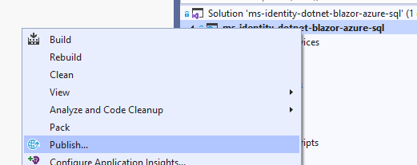

# Use Azure SQL Server as part of Blazor Server App

> This is an unofficial (yet) sample with quick example of how to connect Blazor Server App to Azure SQL.
  Current readme file is just a draft with minimal required actions and shall be extended to a standard Azure-Samples readme file format in near future.

## Overview

The sample demonstrates how to use an Azure SQL Database with Blazor Server App.

## Pre-Requirements

1. Visual Studio.
1. Azure Subscription and Tenant with at least one user created in it.
1. Azure SQL Server database to be already deployed on Azure with a Tenant set user as Admin.

## How to use the sample

1. Clone this repository or download .zip file
1. Open the ms-identity-dotnet-blazor-azure-sql.sln file in Visual Studio

### Run locally
1. Press **F5**

### Deploy to Azure

#### Create Publish profile and configure App Registration
1. Right click on project name and select **Publish** 
1. 
