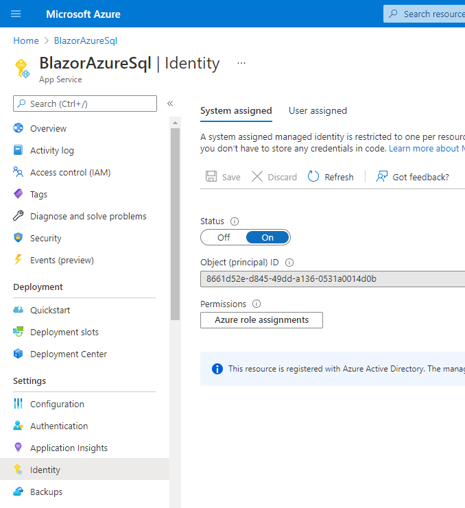
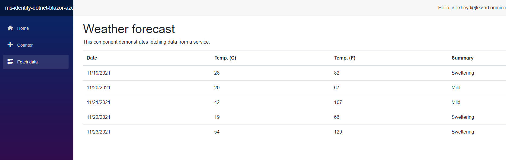

# Use Azure SQL Server as part of Blazor Server App

> This is an unofficial (yet) sample with quick example of how to connect Blazor Server App to Azure SQL.
  Current readme file is just a draft with minimal required actions and shall be extended to a standard Azure-Samples readme file format in near future.

## Overview

The sample demonstrates how to use an Azure SQL Database with Blazor Server App.

## Pre-Requirements

1. Visual Studio.
1. Azure Subscription and Tenant with at least one user created in it.
1. All users that are using the application should be part of the Tenant

## How to use the sample

1. Clone this repository or download .zip file
1. Open the ms-identity-dotnet-blazor-azure-sql.sln file in Visual Studio

### Setup SQL Database and grant user permissions for managed identity

1. Create Azure SQL database instance and add your Tenant user as Admin
1. Run next command on the created database

   ```sql
   CREATE TABLE [dbo].[Summary](
   [Summary] [nvarchar](50) NOT NULL) 
   GO;
   Insert into [dbo].Summary values ('Freezing'),('Bracing'),('Chilly'),('Cool'),('Mild'),('Warm'),('Balmy'),('Hot'),('Sweltering'),('Scorching')
   GO;
   CREATE FUNCTION [dbo].[UsernamePrintFn]()
   RETURNS nvarchar(500)
   AS
   BEGIN
       declare @host nvarchar(100), @user nvarchar(100);
       SELECT @host = HOST_NAME() , @user = SUSER_NAME()
       declare @result nvarchar(500) = cast(@user + ' at ' + @host as nvarchar(500))
       -- Return the result of the function
       return @result
   END
   GO
   ```

1. To grant permissions for you App Service on SQL Database, run next 4 commands on your database

   ```sql
   CREATE USER [<identity-name>] FROM EXTERNAL PROVIDER;
   ALTER ROLE db_datareader ADD MEMBER [<identity-name>];
   ALTER ROLE db_datawriter ADD MEMBER [<identity-name>];
   ALTER ROLE db_ddladmin ADD MEMBER [<identity-name>];
   GO
   GRANT EXECUTE TO [<identity-name>]
   GO
   ```

   Where identity-name is usually name of your App Service.

1. Add next lines to [appsettings.json](https://github.com/aremo-ms/ms-identity-dotnet-blazor-azure-sql/blob/master/appsettings.json)

   ```json
   "ConnectionStrings": {
    "SqlDbContext": "Server=tcp:<server name>.database.windows.net;database=<database name>;Authentication=Active Directory Default"
    }
   ```

### Run locally

1. Press **F5**

### Run on Azure

1. Create App registration on Azure Portal
1. Publish the application to Azure from Visual Studio

> Don't use same name for App Service as you've used for App registration

1. Make sure Managed Identity is enabled on the App Service 
1. Go to App Service Properties, copy **Virtual IP Address** value and add it to SQL Database **Firewall Settings**.
1. Run the website

### Get Data from Azure SQl Server

1. Go to **Fetch Data** 
1. You should see the above forecast table

## About the code

The code is as is coming out of standard Visual Studio 2019 **Blazor Server App** template. The only difference here is that instead of getting hardcoded list of Summaries inside [GetForecastAsync method](https://github.com/aremo-ms/ms-identity-dotnet-blazor-azure-sql/blob/77ef2e3077620992736f06bbb3bdad1c904a1760/Data/WeatherForecastService.cs#L20), a request is done out of Azure SQL Server.

   ```csharp
   public async Task<WeatherForecast[]> GetForecastAsync(DateTime startDate)
        {
            //database call
            var dbSummaries = await GetSummaries();

            var rnd = new Random();
            return Enumerable.Range(1, 5).Select(index => new WeatherForecast
            {
                Date = startDate.AddDays(index),
                TemperatureC = rnd.Next(-20, 55),
                Summary = dbSummaries[rnd.Next(dbSummaries.Count)]
            }).ToArray();
        }

        private async Task<IList<string>> GetSummaries()
        {
            var summaryList = new List<string>();
            using (SqlConnection conn = new(_configuration.GetConnectionString("SqlDbContext")))
            {
                if (conn.State == ConnectionState.Closed)
                    await conn.OpenAsync();
                try
                {
                    SqlCommand cmd = new(@"select * from Summary", conn);

                    var myReader = await cmd.ExecuteReaderAsync();

                    while (myReader.Read())
                    {
                        summaryList.Add(myReader["Summary"].ToString());
                    }
                }
                catch (Exception)
                {
                    throw;
                }
                finally
                {
                    if (conn.State == ConnectionState.Open)
                        await conn.CloseAsync();
                }
            }

            return summaryList;
        }
   ```
