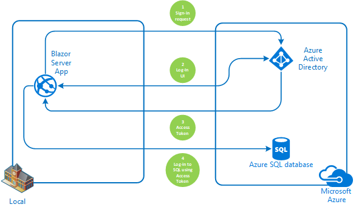

# How to use an authenticated user's credentials for log-in to an Azure SQL Database from Blazor Web Server App

[](https://identitydivision.visualstudio.com/IDDP/_build/latest?definitionId=819)

Table Of Contents

* [Scenario](#Scenario)
* [Prerequisites](#Prerequisites)
* [Setup the sample](#Setup-the-sample)
* [Troubleshooting](#Troubleshooting)
* [Using the sample](#Using-the-sample)
* [About the code](#About-the-code)
* [How the code was created](#How-the-code-was-created)
* [How to deploy this sample to Azure](#How-to-deploy-this-sample-to-Azure)
* [Next Steps](#Next-Steps)
* [Contributing](#Contributing)
* [Learn More](#Learn-More)

## Scenario

This sample demonstrates a Blazor Server App querying an Azure SQL Database with the same authenticated user logged-in into the database. In other words, SQL Database will act exactly for user logged-in instead of active with administrator access rights.



## Prerequisites

- Either [Visual Studio](https://visualstudio.microsoft.com/downloads/) or [Visual Studio Code](https://code.visualstudio.com/download) and [.NET Core SDK](https://www.microsoft.com/net/learn/get-started)
- Azure subscription and Tenant with at least one user created in it
- Azure [SQL Database](https://docs.microsoft.com/en-us/azure/azure-sql/database/single-database-create-quickstart)


## Setup the sample


### Step 1: Clone or download this repository

From your shell or command line:

```console
    git clone https://github.com/Azure-Samples/ms-identity-dotnet-blazor-azure-sql.git
```

or download and extract the repository .zip file.

>:warning: To avoid path length limitations on Windows, we recommend cloning into a directory near the root of your drive.

### Step 2: Setup SQL Database and grant user permissions for managed identity

1. Create [Azure SQL Database](https://docs.microsoft.com/en-us/azure/azure-sql/database/single-database-create-quickstart) and add your Tenant user as Admin **OR** [install local SQL server](https://www.microsoft.com/sql-server/sql-server-downloads) (Express edition is enough)
2. Install [SQL Server Management Studio](https://docs.microsoft.com/sql/ssms/download-sql-server-management-studio-ssms) or find another way to manipulate the database if you prefer.
3. [Create](https://docs.microsoft.com/sql/relational-databases/databases/create-a-database) an empty Database
4. On the created database run next commands

   ```sql
   CREATE TABLE [dbo].[Summary](
   [Summary] [nvarchar](50) NOT NULL) 
   GO;
   Insert into [dbo].Summary values ('Freezing'),('Bracing'),('Chilly'),('Cool'),('Mild'),('Warm'),('Balmy'),('Hot'),('Sweltering'),('Scorching')
   GO;
   CREATE FUNCTION [dbo].[UsernamePrintFn]()
   RETURNS nvarchar(500)
   AS
   BEGIN
       declare @host nvarchar(100), @user nvarchar(100);
       SELECT @host = HOST_NAME() , @user = SUSER_NAME()
       declare @result nvarchar(500) = cast(@user + ' at ' + @host as nvarchar(500))
       -- Return the result of the function
       return @result
   END
   GO
   ```

5. Create a user from your Tenant inside the database and grant EXECUTE permission by running next commands inside query window

   ```sql
   CREATE USER [tenant_user_name (like alexbeyd@kkaad.onmicrosof.com)] FROM EXTERNAL PROVIDER; 
   EXECUTE sp_addrolemember db_datareader, [tenant_user_name (like alexbeyd@kkaad.onmicrosof.com)];
   grant execute to [tenant_user_name (like alexbeyd@kkaad.onmicrosof.com)]
   ```

6. Go to App Service Properties, copy **Virtual IP Address** value and add it to SQL Database **Firewall Settings**.
7. Add connection string to [appsettings.json](https://github.com/aremo-ms/ms-identity-dotnet-blazor-azure-sql/blob/master/appsettings.json)


### Step 3: Application Registration

There is one project in this sample. To register it, you can:

Follow the [manual steps](#Manual-steps)

**OR**

#### Run automation scripts

* use PowerShell scripts that:
  * **automatically** creates the Azure AD applications and related objects (passwords, permissions, dependencies) for you.
  * modify the projects' configuration files.

  <details>
   <summary>Expand this section if you want to use this automation:</summary>

    > **WARNING**: If you have never used **Azure AD Powershell** before, we recommend you go through the [App Creation Scripts guide](./AppCreationScripts/AppCreationScripts.md) once to ensure that your environment is prepared correctly for this step.
  
    1. On Windows, run PowerShell as **Administrator** and navigate to the root of the cloned directory
    1. In PowerShell run:

       ```PowerShell
       Set-ExecutionPolicy -ExecutionPolicy RemoteSigned -Scope Process -Force
       ```

    1. Run the script to create your Azure AD application and configure the code of the sample application accordingly.
    1. For interactive process - in PowerShell run:

       ```PowerShell
       cd .\AppCreationScripts\
       .\Configure.ps1 -TenantId "[Optional] - your tenant id" -Environment "[Optional] - Azure environment, defaults to 'Global'"
       ```

    1. In case the previous script fails with error about duplicate App Registration, you might want to run the next cleanup script prior to re-running Configure.ps1

       ```powershell
       cd .\AppCreationScripts\
       .\Cleanup.ps1
       ```

       > Other ways of running the scripts are described in [App Creation Scripts guide](./AppCreationScripts/AppCreationScripts.md)
       > The scripts also provide a guide to automated application registration, configuration and removal which can help in your CI/CD scenarios.

  </details>

#### Manual Steps

 > Note: skip this part if you've just used Automation steps

Follow the steps below for manually register and configure your apps

<details>
   <summary>Expand this section if you want to use the steps:</summary>

   1. Sign in to the [Azure portal](https://portal.azure.com).
   2. If your account is present in more than one Azure AD tenant, select your profile at the top right corner in the menu on top of the page, and then **switch directory** to change your portal session to the desired Azure AD tenant.

##### Register the client app (ClientApp-blazor-azuresql)

   1. Navigate to the [Azure portal](https://portal.azure.com) and select the **Azure AD** service.
   1. Select the **App Registrations** blade on the left, then select **New registration**.
   1. In the **Register an application page** that appears, enter your application's registration information:
      * In the **Name** section, enter a meaningful application name that will be displayed to users of the app, for example `ClientApp-blazor-azuresql`.
   1. Under **Supported account types**, select **Accounts in this organizational directory only**
   1. Click **Register** to create the application.
   1. In the app's registration screen, find and note the **Application (client) ID**. You use this value in your app's configuration file(s) later in your code.
   1. In the app's registration screen, select **Authentication** in the menu.
      * If you don't have a platform added, select **Add a platform** and select the **Web** option.
   1. In the **Redirect URI** section enter the following redirect URIs: 
      * `https://localhost:44348/`
      * `https://localhost:44348/signin-oidc`
   1. In the **Front-channel logout URL** section, set it to `https://localhost:44348/signout-oidc`.
   1. Select **ID tokens (used for implicit and hybrid flows)** checkbox.
   1. Click **Save** to save your changes.
   1. In the app's registration screen, select the **Certificates & secrets** blade in the left to open the page where you can generate secrets and upload certificates.
   1. In the **Client secrets** section, select **New client secret**:
      * Optionally you can type a key description (for instance `app secret`),
      * Select recommended Expire duration.
      * The generated key value will be displayed when you select the **Add** button. Copy and save the generated value for use in later steps.
      * You'll need this key later in your code's configuration files. This key value will not be displayed again, and is not retrievable by any other means, so make sure to note it from the Azure portal before navigating to any other screen or blade.

##### Configure the client app (ClientApp-blazor-azuresql) to use your app registration

   Open the project in your IDE (like Visual Studio or Visual Studio Code) to configure the code.

   > In the steps below, "ClientID" is the same as "Application ID" or "AppId".

   1. Open the `Client\appsettings.json` file.
      1. Find the key `Domain` and replace the existing value with your Azure AD tenant name.
      2. Find the key `TenantId` and replace the existing value with your Azure AD tenant ID.
      3. Find the key `ClientId` and replace the existing value with the application ID (clientId) of `ClientApp-blazor-azuresql` app copied from the Azure portal.
      4. Find the key `ClientSecret` and replace the existing value with the key you saved during the creation of `ClientApp-blazor-azuresql` copied from the Azure portal.

  **For more information, visit** [Register Application AAD](https://docs.microsoft.com/en-us/azure/active-directory/develop/quickstart-register-app)

  </details>

### Step 4: Running the sample

 To run the sample, run the next commands:

```console
    You don't have to change current folder. 
    dotnet run
```

## Troubleshooting

<details>
 <summary>Expand for troubleshooting info</summary>

Use [Stack Overflow](http://stackoverflow.com/questions/tagged/msal) to get support from the community.
Ask your questions on Stack Overflow first and browse existing issues to see if someone has asked your question before.
Make sure that your questions or comments are tagged with [`azure-active-directory` `adal` `msal` `dotnet`].

If you find a bug in the sample, please raise the issue on [GitHub Issues](../../issues).

To provide a recommendation, visit the following [User Voice page](https://feedback.azure.com/forums/169401-azure-active-directory).
</details>

## Using the sample

<details>
 <summary>Expand to see how to use the sample</summary>

 Running from **VS Code**:

 ```powershell
  dotnet run
 ```

 If you're running from Visual Studio, press **F5** or **Ctrl+F5** (for no debug run)

 On the main page you will be offered to Log In or to go to a "Fetch data" page
 If you choose to go to "Fetch data" page without logging-in, you will be asked to login with a standard UI.
 When the application will be logged in, it will try to connect to Azure SQL Database with the same access token it acquired for the currently logged user.
 Successful connection will be indicated when the page will state that the user is logged into the database and a table with mock forecast data is displayed.

 

 The page displays a message with user and host names that are values of @user and @host on SQL Database.

Did the sample not work for you as expected? Did you encounter issues trying this sample? Then please reach out to us using the [GitHub Issues](../../../../issues) page.

[Consider taking a moment to share your experience with us.](https://forms.office.com/Pages/ResponsePage.aspx?id=v4j5cvGGr0GRqy180BHbRz0h_jLR5HNJlvkZAewyoWxUNEFCQ0FSMFlPQTJURkJZMTRZWVJRNkdRMC4u)
</details>

## About the code

<details>
 <summary>Expand the section</summary>

 The main purpose of this sample is to show how to propagate AAD user to SQL server. The scenario is as follows:

 1. Get Access Token through interactive log-in process and cache it. To enable caching we have to add the 2 last lines to AAD configuration inside Program.cs:

  ```csharp
    builder.Services.AddAuthentication(OpenIdConnectDefaults.AuthenticationScheme)
                .AddMicrosoftIdentityWebApp(builder.Configuration.GetSection("AzureAd"))
                .EnableTokenAcquisitionToCallDownstreamApi() 
                .AddInMemoryTokenCaches();
  ```

 2. Every time, the new SQL connection is created, acquire the cached token and add it to the connection object. If the cached token is unavailable, the MsalUiRequiredException will be thrown and interactive Authorization process will be kicked-off. Here is relevant code snippet from UserAADServices.cs:

  ```csharp
    public async Task<string> GetAccessToken(AuthenticationState authState)
        {
            string accessToken = string.Empty;

            //https://database.windows.net/.default
            var scopes = new string[] { _azureSettings["Scopes"] };

            try
            {
                var accountIdentifier = GetAccountIdentifier(authState);

                IAccount account = await _app.GetAccountAsync(accountIdentifier);

                AuthenticationResult authResult = await _app.AcquireTokenSilent(scopes, account).ExecuteAsync();
                accessToken = authResult.AccessToken;
            }
            catch (MsalUiRequiredException)
            {
                _consentHandler.ChallengeUser(scopes);
                return accessToken;
            }

            return accessToken;
        }
  ```

  > Notice that the code is using a special default scope to be able to work with SQL Server - **https://database.windows.net/.default**

</details>

## How the code was created

<details>
 <summary>Expand the section</summary>

 The application was generated out of standard Visual Studio template for **[Blazor Server App](https://docs.microsoft.com/en-us/aspnet/core/blazor/tooling?view=aspnetcore-6.0&pivots=windows)**
 After that SQL Server Database functionality and Authentication were configured.

1. Create initial sample, follow the [instructions](https://docs.microsoft.com/en-us/aspnet/core/blazor/tooling?view=aspnetcore-6.0&pivots=windows).  During the setup choose to use Microsoft Identity PLatform for Authentication.

1. Modify appsettings.json file
Replace contents of the configuration by the below lines:

```json
{
  "AzureAd": {
    "Instance": "https://login.microsoftonline.com/",
    "Domain": "[Enter the domain of your tenant, e.g. contoso.onmicrosoft.com]",
    "TenantId": "[Enter 'common', or 'organizations' or the Tenant Id (Obtained from the Azure portal. Select 'Endpoints' from the 'App registrations' blade and use the GUID in any of the URLs), e.g. da41245a5-11b3-996c-00a8-4d99re19f292]",
    "ClientId": "[Enter the Client Id (Application ID obtained from the Azure portal), e.g. ba74781c2-53c2-442a-97c2-3d60re42f403]",
    "SignedOutCallbackPath": "/signout-callback-oidc",
    "Scopes": "https://database.windows.net/.default",
    "OnSignOutRedirectPage": "https://localhost:44348",
    "ClientSecret": "[Copy the client secret added to the app from the Azure portal]",
    //"ClientCertificates": [
    //  {
    //    "SourceType": "KeyVault",
    //    "KeyVaultUrl": "[Enter URL for you Key Vault]",
    //    "KeyVaultCertificateName": "[Enter name of the certificate]"
    //  }
    //]
  },
  "Logging": {
    "LogLevel": {
      "Default": "Information",
      "Microsoft": "Warning",
      "Microsoft.Hosting.Lifetime": "Information"
    }
  },
  "AllowedHosts": "*",
  "ConnectionStrings": {
    "SqlDbContext": "Server=<your server name>;database=<your database name>;Persist Security Info=False;MultipleActiveResultSets=False;Encrypt=True;TrustServerCertificate=False"
  }
}
```

1. Open Program.cs.
   - Replace

    ```csharp
     builder.Services.AddAuthentication(OpenIdConnectDefaults.AuthenticationScheme)
     .AddMicrosoftIdentityWebApp(builder.Configuration.GetSection("AzureAd"));
    ```

    by

    ```csharp
     builder.Services.AddAuthentication(OpenIdConnectDefaults.AuthenticationScheme)
                .AddMicrosoftIdentityWebApp(builder.Configuration.GetSection("AzureAd"))
                .EnableTokenAcquisitionToCallDownstreamApi(new string[] { "https://sql.azuresynapse.usgovcloudapi.net/user_impersonation" })
                .AddInMemoryTokenCaches();

    ```

   - Comment the below code. If you leave it uncommented, the application will try to login immediately after start and you won't have a chance to see main page while user is not logged-in

     ```csharp
      builder.Services.AddAuthorization(options =>
      {
       // By default, all incoming requests will be authorized according to the default policy
       options.FallbackPolicy = options.DefaultPolicy;
      });
     ```

   - Replace

     ```csharp
       builder.Services.AddSingleton<WeatherForecastService>();
      ```

      by

      ```csharp
       builder.Services
                .AddScoped<WeatherForecastService>()
                .AddScoped<UserAADService>()
                .AddSingleton<SqlDatabase>();
      ```

1. Open Data/WeatherForecastService.cs and replace the entire class by below code:

    ```csharp
     public class WeatherForecastService
     {
        private readonly UserAADService _userAAD;
        private readonly SqlDatabase _database;

        public WeatherForecastService(UserAADService userAAD, SqlDatabase database)
        {
            _userAAD = userAAD;
            _database = database;
        }

        public async Task<WeatherForecast[]> GetForecastAsync(DateTime startDate, AuthenticationState authState)
        {
            //database call
            var dbSummaries = await GetSummaries(authState);

            var rnd = new Random();
            return Enumerable.Range(1, 5).Select(index => new WeatherForecast
            {
                Date = startDate.AddDays(index),
                TemperatureC = rnd.Next(-20, 55),
                Summary = dbSummaries[rnd.Next(dbSummaries.Count)]
            }).ToArray();
        }

        private async Task<IList<string>> GetSummaries(AuthenticationState authState)
        {
            var summaryList = new List<string>();
            using (SqlConnection conn = _database.GetSqlConnection())
            {
                conn.AccessToken = await _userAAD.GetAccessToken(authState);
                if (conn.AccessToken.IsNullOrEmpty()) return summaryList;

                try
                {
                    if (conn.State == ConnectionState.Closed)
                    await conn.OpenAsync();
                    
                    SqlCommand cmd = new(@"select * from Summary", conn);

                    var myReader = await cmd.ExecuteReaderAsync();

                    while (myReader.Read())
                    {
                        summaryList.Add(myReader["Summary"].ToString());
                    }
                }
                catch (Exception)
                {
                    return summaryList;
                }
                finally
                {
                    if (conn.State == ConnectionState.Open)
                        await conn.CloseAsync();
                }
            }

            return summaryList;
        }
     }
    ```

1. Create SqlDatabase class

    ```csharp
     public class SqlDatabase
     {
        IConfiguration _configuration;

        public SqlDatabase(IConfiguration configuration)
        {
            _configuration = configuration;
        }

        public SqlConnection GetSqlConnection(string connStringName = "SqlDbContext")
        {
            return new(_configuration.GetConnectionString(connStringName));
        }
     }
    ```

1. Create UserAADService class

    ```csharp
     public class UserAADService
     {
        private readonly IConfiguration _configuration;
        private readonly IConfidentialClientApplication _app;
        private readonly IConfigurationSection _azureSettings;
        private readonly SqlDatabase _database;
        readonly MicrosoftIdentityConsentAndConditionalAccessHandler _consentHandler;

        public UserAADService(IConfiguration configuration, SqlDatabase database, MicrosoftIdentityConsentAndConditionalAccessHandler consentHandler)
        {
            _consentHandler = consentHandler;

            _database = database;

            _configuration = configuration;

            _azureSettings = _configuration.GetSection("AzureAd");

            _app =
                ConfidentialClientApplicationBuilder.Create(_azureSettings["ClientId"])
                    .WithClientSecret(_azureSettings["ClientSecret"])
                    .WithAuthority(AzureCloudInstance.AzurePublic, _azureSettings["TenantId"])
                    .WithCacheOptions(CacheOptions.EnableSharedCacheOptions)
                    .Build();
        }

        public async Task<string> GetAccessToken(AuthenticationState authState)
        {
            string accessToken = string.Empty;
            var scopes = new string[] { _azureSettings["Scopes"] };

            try
            {
                var accountIdentifier = GetAccountIdentifier(authState);

                IAccount account = await _app.GetAccountAsync(accountIdentifier);

                AuthenticationResult authResult = await _app.AcquireTokenSilent(scopes, account).ExecuteAsync();
                accessToken = authResult.AccessToken;
            }
            catch (Exception)
            {
                _consentHandler.ChallengeUser(scopes);
                return accessToken;
            }

            return accessToken;
        }

        public async Task<string> GetDatabaseLoggedUser(AuthenticationState authState)
        {
            var loggedUser = "N/A";

            using (SqlConnection conn = _database.GetSqlConnection())
            {
                try
                {
                    var token = await GetAccessToken(authState);

                    if (string.IsNullOrEmpty(token)) return loggedUser;

                    conn.AccessToken = token;

                    if (conn.State == ConnectionState.Closed)
                        await conn.OpenAsync();

                    SqlCommand cmd = new(@"SELECT [dbo].[UsernamePrintFn]()", conn);

                    loggedUser = (await cmd.ExecuteScalarAsync()).ToString();

                }
                catch (Exception)
                {
                    return loggedUser;
                }
                finally
                {
                    if (conn.State == ConnectionState.Open)
                        await conn.CloseAsync();
                }
            }

            return loggedUser;
        }

        private string GetAccountIdentifier(AuthenticationState authState)
        {
            if (authState.User.Identities.First().Claims.Where(c => c.Type == "uid").Count() == 0 ||
                authState.User.Identities.First().Claims.Where(c => c.Type == "utid").Count() == 0)
            {
                return null;
            }
            //return "<user object id>.<tenant id>" which is account identifier;
            return authState.User.Identities.First().Claims.Where(c => c.Type == "uid").First().Value + "." +
                authState.User.Identities.First().Claims.Where(c => c.Type == "utid").First().Value;
        }
     }
    ```

1. Open Pages/FetchData.razor and replace the entire code with this:

    ```csharp
        @page "/fetchdata"

        @using ms_identity_dotnet_blazor_azure_sql.AAD
        @using ms_identity_dotnet_blazor_azure_sql.Data
        @inject WeatherForecastService ForecastService
        @inject UserAADService UserAADService
        @inject AuthenticationStateProvider GetAuthenticationStateAsync

        <h1>Weather forecast</h1>
        <h4><strong>@_greetingsMessage</strong></h4>

        <p>This component demonstrates fetching data from a service that is connected to SQL database.</p>

        @if (forecasts == null)
        {
            <p><em>Loading...</em></p>
        }
        else
        {
            <table class="table">
                <thead>
                    <tr>
                        <th>Date</th>
                        <th>Temp. (C)</th>
                        <th>Temp. (F)</th>
                        <th>Summary</th>
                    </tr>
                </thead>
                <tbody>
                    @foreach (var forecast in forecasts)
                    {
                        <tr>
                            <td>@forecast.Date.ToShortDateString()</td>
                            <td>@forecast.TemperatureC</td>
                            <td>@forecast.TemperatureF</td>
                            <td>@forecast.Summary</td>
                        </tr>
                    }
                </tbody>
            </table>
        }

        @code {
            private WeatherForecast[] forecasts;
            private string _loggedUser;
            private string _greetingsMessage;

            protected override async Task OnInitializedAsync()
            {
                var authstate = await GetAuthenticationStateAsync.GetAuthenticationStateAsync();

                _loggedUser = await UserAADService.GetDatabaseLoggedUser(authstate);

                if (_loggedUser == "N/A")
                    _greetingsMessage = "Please Log Out of the current user and re-login.";
                else
                {
                    _greetingsMessage = $"The user logged into SQL Database is {_loggedUser}";

                    forecasts = await ForecastService.GetForecastAsync(DateTime.Now, authstate);
                }
            }
        }
    ```

1. Delete **counter** link from Shared/NavMenu.razor

</details>


## How to deploy this sample to Azure

<details>
 <summary>Expand the section</summary>


</details>


## Next Steps

Learn how to:

* [Change your app to sign-in users from any organization or any Microsoft accounts](https://github.com/Azure-Samples/active-directory-aspnetcore-webapp-openidconnect-v2/tree/master/1-WebApp-OIDC/1-3-AnyOrgOrPersonal)
* [Enable users from National clouds to sign-in to your application](https://github.com/Azure-Samples/active-directory-aspnetcore-webapp-openidconnect-v2/tree/master/1-WebApp-OIDC/1-4-Sovereign)
* [Enable your Web App to call a Web API on behalf of the signed-in user](https://github.com/Azure-Samples/ms-identity-dotnetcore-ca-auth-context-app)

## Contributing

If you'd like to contribute to this sample, see [CONTRIBUTING.MD](/CONTRIBUTING.md).

This project has adopted the [Microsoft Open Source Code of Conduct](https://opensource.microsoft.com/codeofconduct/). For more information, see the [Code of Conduct FAQ](https://opensource.microsoft.com/codeofconduct/faq/) or contact [opencode@microsoft.com](mailto:opencode@microsoft.com) with any additional questions or comments.

## Learn More

* Microsoft identity platform (Azure Active Directory for developers)](https://docs.microsoft.com/azure/active-directory/develop/)
* Overview of Microsoft Authentication Library (MSAL)](https://docs.microsoft.com/azure/active-directory/develop/msal-overview)
* Authentication Scenarios for Azure AD](https://docs.microsoft.com/azure/active-directory/develop/authentication-flows-app-scenarios)
* Azure AD code samples](https://docs.microsoft.com/azure/active-directory/develop/sample-v2-code)
* Register an application with the Microsoft identity platform](https://docs.microsoft.com/azure/active-directory/develop/quickstart-register-app)
* Building Zero Trust ready apps](https://aka.ms/ztdevsession)

For more information, visit the following links:

 *To lean more about the application registration, visit:
  *[Quickstart: Register an application with the Microsoft identity platform](https://docs.microsoft.com/azure/active-directory/develop/quickstart-register-app)
  *[Quickstart: Configure a client application to access web APIs](https://docs.microsoft.com/azure/active-directory/develop/quickstart-configure-app-access-web-apis)
  *[Quickstart: Configure an application to expose web APIs](https://docs.microsoft.com/azure/active-directory/develop/quickstart-configure-app-expose-web-apis)

  *To learn more about the code, visit:
  *[Conceptual documentation for MSAL.NET](https://github.com/AzureAD/microsoft-authentication-library-for-dotnet/wiki#conceptual-documentation) and in particular:
  *[Acquiring tokens with authorization codes on web apps](https://github.com/AzureAD/microsoft-authentication-library-for-dotnet/wiki/Acquiring-tokens-with-authorization-codes-on-web-apps)
  *[Customizing Token cache serialization](https://github.com/AzureAD/microsoft-authentication-library-for-dotnet/wiki/token-cache-serialization)

  *To learn more about security in aspnetcore,
  *[Introduction to Identity on ASP.NET Core](https://docs.microsoft.com/aspnet/core/security/authentication/identity)
  *[AuthenticationBuilder](https://docs.microsoft.com/dotnet/api/microsoft.aspnetcore.authentication.authenticationbuilder)
  *[Azure Active Directory with ASP.NET Core](https://docs.microsoft.com/aspnet/core/security/authentication/azure-active-directory)


